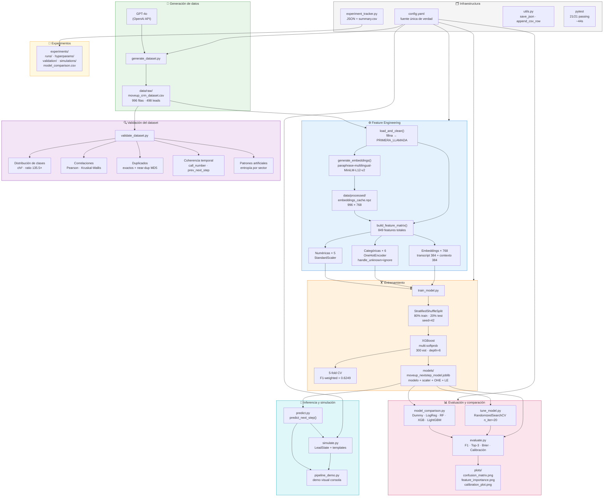
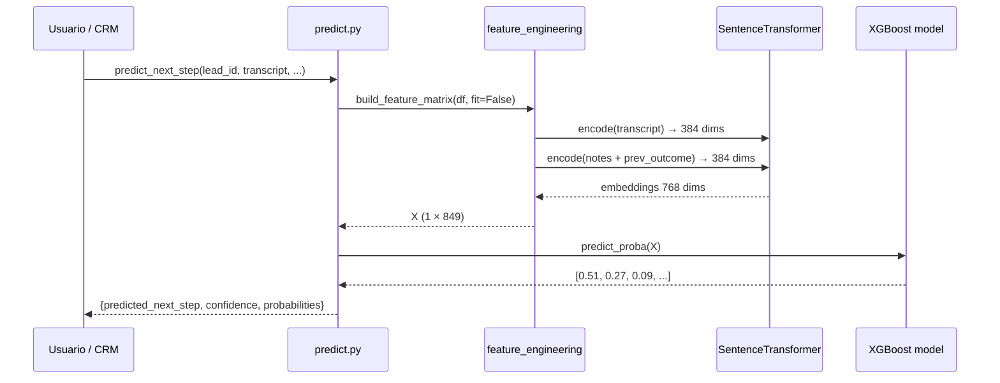
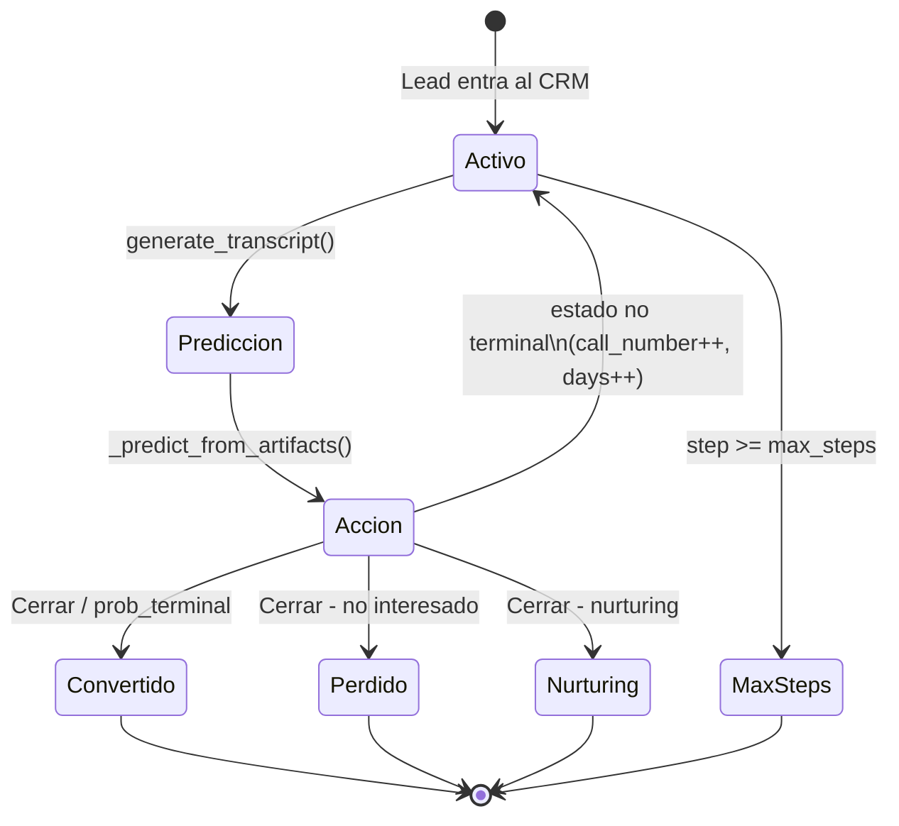

# MoveUp Next-Action Predictor — Architecture

## Pipeline completo

```mermaid
flowchart TD
    subgraph GEN["🔧 Generación de datos"]
        GPT["GPT-4o\n(OpenAI API)"]
        GDS["generate_dataset.py"]
        CSV["data/raw/\nmoveup_crm_dataset.csv\n996 filas · 498 leads"]
        GPT --> GDS --> CSV
    end

    subgraph FE["⚙️ Feature Engineering"]
        LAC["load_and_clean()\nfillna → PRIMERA_LLAMADA"]
        EMB["generate_embeddings()\nparaphrase-multilingual-MiniLM-L12-v2"]
        EMB_CACHE["data/processed/\nembeddings_cache.npz\n996 × 768"]
        BFM["build_feature_matrix()\n849 features totales"]

        NUM["Numéricas × 5\nStandardScaler"]
        OHE["Categóricas × 6\nOneHotEncoder\nhandle_unknown=ignore"]
        VEC["Embeddings × 768\ntranscript 384 + contexto 384"]

        LAC --> EMB
        EMB --> EMB_CACHE
        EMB_CACHE --> BFM
        LAC --> BFM
        BFM --> NUM
        BFM --> OHE
        BFM --> VEC
    end

    subgraph TRAIN["🏋️ Entrenamiento"]
        TM["train_model.py"]
        SPLIT["StratifiedShuffleSplit\n80% train · 20% test\nseed=42"]
        XGB["XGBoost\nmulti:softprob\n300 est · depth=6"]
        CV["5-fold CV\nF1-weighted = 0.6249"]
        JOBLIB["models/\nmoveup_nextstep_model.joblib\nmodelo + scaler + OHE + LE"]

        TM --> SPLIT
        SPLIT --> XGB
        XGB --> CV
        XGB --> JOBLIB
    end

    subgraph EVAL["📊 Evaluación y comparación"]
        MC["model_comparison.py\nDummy · LogReg · RF · XGB · LightGBM"]
        TUN["tune_model.py\nRandomizedSearchCV n_iter=20"]
        EVL["evaluate.py\nF1 · Top-3 · Brier · Calibración"]
        PLOTS["plots/\nconfusion_matrix.png\nfeature_importance.png\ncalibration_plot.png"]

        MC --> EVL
        TUN --> EVL
        EVL --> PLOTS
    end

    subgraph VAL["🔍 Validación del dataset"]
        VD["validate_dataset.py"]
        C1["Distribución de clases\nchi² · ratio 135.5×"]
        C2["Correlaciones\nPearson · Kruskal-Wallis"]
        C3["Duplicados\nexactos + near-dup MD5"]
        C4["Coherencia temporal\ncall_number · prev_next_step"]
        C5["Patrones artificiales\nentropía por sector"]
        VD --> C1 & C2 & C3 & C4 & C5
    end

    subgraph RUNTIME["🚀 Inferencia y simulación"]
        PRED["predict.py\npredict_next_step()"]
        SIM["simulate.py\nLeadState + templates"]
        DEMO["pipeline_demo.py\ndemo visual consola"]

        PRED --> SIM
        PRED --> DEMO
        SIM --> DEMO
    end

    subgraph INFRA["🗂️ Infraestructura"]
        CFG["config.yaml\nfuente única de verdad"]
        ET["experiment_tracker.py\nJSON + summary.csv"]
        UT["utils.py\nsave_json · append_csv_row"]
        TESTS["pytest\n21/21 passing\n~44s"]
    end

    subgraph RESULTS["📁 Experimentos"]
        EXP["experiments/\nruns/ · hyperparams/\nvalidation/ · simulations/\nmodel_comparison.csv"]
    end

    CSV --> LAC
    NUM & OHE & VEC --> TM
    JOBLIB --> MC & TUN & EVL
    JOBLIB --> PRED
    CSV --> VD
    ET --> EXP
    CFG --> GDS & FE & TRAIN & EVAL & SIM

    style GEN fill:#e8f5e9,stroke:#388e3c
    style FE fill:#e3f2fd,stroke:#1976d2
    style TRAIN fill:#fff3e0,stroke:#f57c00
    style EVAL fill:#fce4ec,stroke:#c2185b
    style VAL fill:#f3e5f5,stroke:#7b1fa2
    style RUNTIME fill:#e0f7fa,stroke:#0097a7
    style INFRA fill:#f5f5f5,stroke:#616161
    style RESULTS fill:#fff8e1,stroke:#f9a825
```

## Flujo de una predicción individual

```mermaid
sequenceDiagram
    participant U as Usuario / CRM
    participant P as predict.py
    participant FE as feature_engineering
    participant ST as SentenceTransformer
    participant XGB as XGBoost model

    U->>P: predict_next_step(lead_id, transcript, ...)
    P->>FE: build_feature_matrix(df, fit=False)
    FE->>ST: encode(transcript) → 384 dims
    FE->>ST: encode(notes + prev_outcome) → 384 dims
    ST-->>FE: embeddings 768 dims
    FE-->>P: X (1 × 849)
    P->>XGB: predict_proba(X)
    XGB-->>P: [0.51, 0.27, 0.09, ...]
    P-->>U: {predicted_next_step, confidence, probabilities}
```

## Bucle del pipeline demo

```mermaid
stateDiagram-v2
    [*] --> Activo : Lead entra al CRM

    Activo --> Prediccion : generate_transcript()
    Prediccion --> Accion : _predict_from_artifacts()
    Accion --> Activo : estado no terminal\n(call_number++, days++)

    Accion --> Convertido : Cerrar / prob_terminal
    Accion --> Perdido : Cerrar - no interesado
    Accion --> Nurturing : Cerrar - nurturing
    Activo --> MaxSteps : step >= max_steps

    Convertido --> [*]
    Perdido --> [*]
    Nurturing --> [*]
    MaxSteps --> [*]
```

## Matriz de features (849 columnas)

```mermaid
block-beta
  columns 3

  block:num["Numéricas\n× 5"]:1
    n1["employees"]
    n2["revenue"]
    n3["call_number"]
    n4["days_since_entry"]
    n5["days_since_last_call"]
  end

  block:cat["Categóricas OHE\n× ~76"]:1
    c1["company_sector × 20"]
    c2["company_country × 5"]
    c3["company_city × 20"]
    c4["lead_source × 9"]
    c5["contact_role × 15"]
    c6["prev_next_step × 8"]
  end

  block:emb["Embeddings\n× 768"]:1
    e1["transcript\n384 dims"]
    e2["notes + prev_outcome\n384 dims"]
  end
```
